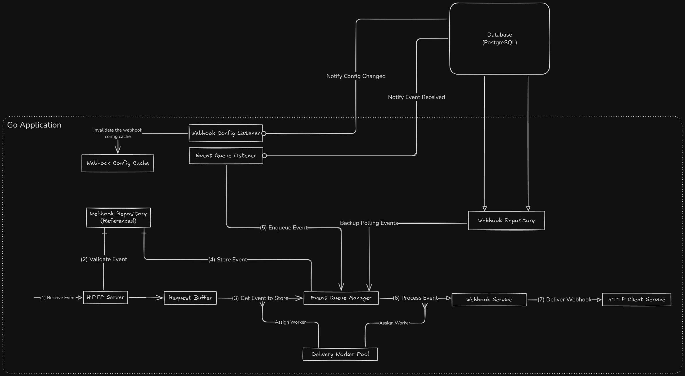

# Webhook Service - Architecture Documentation

## High-Level Component Diagram

## Solution Overview

The Webhook Service is a system designed to handle webhook event notifications with queueing and retry capabilities. It processes and delivers webhook events to subscribers, with mechanisms in place to manage delivery attempts and track event status throughout the pipeline. The service aims to balance reliability and performance while providing an organized approach to webhook event management.

### Core Components

1. **HTTP Server**
   - Built using Echo web framework
   - Exposes endpoints for webhook event submission, health checks, and metrics
   - Handles incoming webhook event requests and validates them

2. **Request Buffer**
   - Temporary buffer for incoming webhook events
   - Prevents request handling from being blocked by downstream processing
   - Configurable size to handle traffic spikes

3. **Request Worker Pool**
   - Worker pool for processing incoming requests
   - Designed to handle traffic fluctuations
   - Workers validate events and prepare them for delivery

4. **Webhook Config Cache**
   - In-memory cache of webhook configurations
   - Reduces database load for frequent webhook validation operations
   - Automatically refreshes to ensure data consistency

5. **Config Listener**
   - Uses PostgreSQL's LISTEN/NOTIFY to detect webhook configuration changes
   - Updates cache when webhook configurations change
   - Helps maintain configuration consistency

6. **Event Queue Manager**
   - Manages the queuing and scheduling of webhook deliveries
   - Implements queueing to distribute system resources
   - Supports retry scheduling with exponential backoff

7. **Event Queue Listener**
   - Uses PostgreSQL's LISTEN/NOTIFY for real-time event notifications
   - Ensures immediate processing of newly created events
   - Falls back to polling for robustness

8. **Delivery Worker Pool**
   - Dynamically scaled worker pool for processing webhook deliveries
   - Balances throughput and resource usage
   - Processes events fairly across different webhooks

9. **HTTP Client Service**
   - Handles the actual delivery of webhook payloads to target URLs
   - Implements timeouts, retries, and circuit breaking
   - Records delivery attempts and responses

10. **Webhook Repository**
    - Interface to the database for webhook-related operations
    - Handles event storage, retrieval, and status updates
    - Manages delivery attempt records

11. **Database**
    - PostgreSQL database for persistent storage
    - Stores webhook configurations, events, and delivery attempts
    - Uses LISTEN/NOTIFY for real-time event notifications

## Technologies Used

1. **Go (Golang)**
   - Core programming language for the application
   - Utilizes goroutines and channels for concurrency
   - Provides type safety and performance benefits

2. **Echo Web Framework**
   - HTTP server framework for the API layer
   - Middleware support for common web service needs
   - Request routing and parameter handling

3. **PostgreSQL**
   - Reliable relational database for persisting webhook configurations and events
   - LISTEN/NOTIFY feature for real-time event notifications
   - Transaction support for data integrity

4. **Docker & Docker Compose**
   - Containerization of the application and its dependencies
   - Simplified deployment and environment consistency
   - Easy horizontal scaling

5. **Connection Pooling**
   - Efficient database connection management
   - Configurable pool size based on worker counts
   - Prevents database connection exhaustion

## Issues and Potential Solutions

### 1. Potential Event Loss During High Load

**Issue**: Under extremely high load, the request buffer could fill up, causing incoming webhook events to be rejected.

**Solution**:
- Consider adding an external message queue (like RabbitMQ or Kafka) as a buffer
- Implement client-side retry with exponential backoff for rejected events

### 2. Database as a Potential Bottleneck

**Issue**: PostgreSQL might become a bottleneck for high-throughput webhook processing, especially with the LISTEN/NOTIFY mechanism.

**Solution**:
- Consider sharding the database by webhook ID
- Implement read replicas for query-heavy operations
- Evaluate NoSQL or time-series databases for event storage
- Optimize database queries and indexes

### 3. Limited Webhook Validation Logic

**Issue**: The current webhook validation is minimal, checking only if the webhook ID exists and if the event type is allowed.

**Solution**:
- Add signature validation for webhook authentication
- Implement payload schema validation
- Add rate limiting per webhook ID
- Consider adding IP whitelisting for added security

### 4. Lack of Observability

**Issue**: While there are basic metrics endpoints, the system lacks comprehensive observability.

**Solution**:
- Add structured logging with correlation IDs
- Implement more detailed metrics for webhook delivery success rates
- Create dashboards and alerts for system health monitoring

### 5. Missing Per-Webhook Rate Limiting

**Issue**: Without per-webhook rate limiting, a single webhook configuration can flood the system with requests, potentially affecting the processing of other webhooks and overall system stability.

**Solution**:
- Implement configurable rate limits for each webhook configuration
- Add a token bucket or leaky bucket algorithm to control request acceptance rate
- Provide configuration options for rate limits at both global and per-webhook levels
- Implement adaptive rate limiting that adjusts based on system load and webhook delivery success rates
- Return appropriate rate limit headers (429 Too Many Requests) when limits are exceeded

### 6. Horizontal Scaling Capabilities

**Strength**: The application is well-designed for horizontal scaling using PostgreSQL's `FOR UPDATE SKIP LOCKED` mechanism, which prevents multiple instances from processing the same events.

**Current Implementation**:
- Uses unique instance IDs to track which instance is processing each event
- Implements `FOR UPDATE SKIP LOCKED` in database queries to efficiently lock and process events
- Includes a cleanup routine to detect and recover from stalled events (when an instance crashes)
- Uses fair queuing to distribute webhook events across multiple customers

**Enhancement Opportunities**:
- **Leader Election for Singleton Operations**: Some operations (like cleanup routines or periodic tasks) would benefit from having only one instance responsible for them. A leader election mechanism would ensure that only one instance performs these operations, avoiding duplicate work and potential conflicts.

- **Instance Health Monitoring**: Currently, stalled events are detected using a timeout, but there's no centralized monitoring of instance health. Implementing a health check system would allow detecting failing instances more quickly and redistributing their workload.

- **Distributed Rate Limiter**: When multiple instances are sending webhooks to the same target, they might collectively exceed rate limits set by the webhook receiver. A distributed rate limiter would coordinate across instances to ensure all webhooks to a particular target respect its rate limits.

- **Enhanced Load Distribution**: The current fair queuing approach distributes events across webhooks, but could be enhanced to consider instance load and capacity. This would ensure events are distributed optimally based on the current processing capacity of each instance, leading to more efficient resource utilization. 
